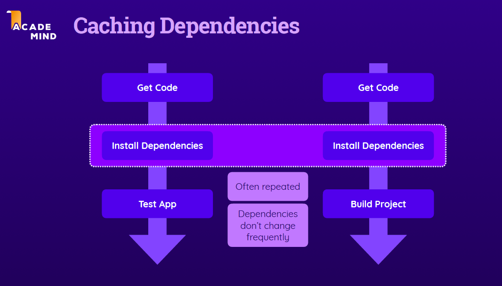

# Sections 5: Job Artifacts and Outputs

## Topic: The need for dependency caching

## Date: 26/01/2025

---

### Cue Column (Questions, Keywords, or Prompts)

---

### Notes Section (Main Notes)

**1. Importance of Dependency Caching**

- Dependency caching is crucial in CI/CD pipelines to speed up the build process.
- By caching dependencies, subsequent jobs can reuse previously downloaded packages, reducing the need for repeated downloads.
- This not only saves time but also bandwidth, making the workflow more efficient.
- For example, the step to install dependencies using `npm ci` takes a couple of seconds if the dependencies are cached, compared to several minutes if they need to be downloaded afresh.
```yml
- name: Install dependencies
  run: npm ci
```

**2. Caching Dependencies**


---
### Summary Section (Summary of Notes)

GitHub is a cloud-based platform that provides Git repository hosting and various services to facilitate version control and collaboration among developers. Key features include cloud storage for Git repositories, enabling backup and teamwork across different machines, as well as tools for code management and collaboration, such as issues, projects, and pull requests.
